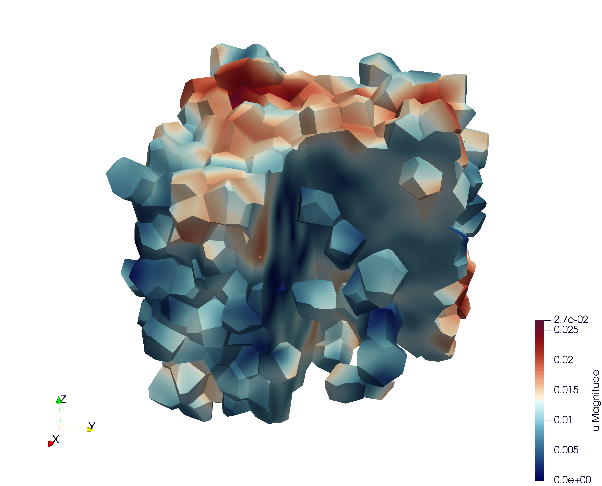
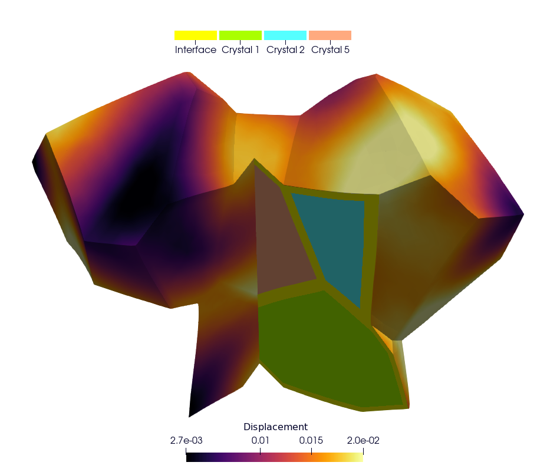

# mm-opera-hpc

This directory groups together the various test cases implemented as part of the OperaHPC project.

## Installation using Spack [recommended]

```
git clone --depth=2 --branch=v1.0.1 https://github.com/spack/spack.git
export SPACK_ROOT=$PWD/spack
source ${SPACK_ROOT}/share/spack/setup-env.sh
```

Firstly, get the mfem-mgis spack repository.

```
git clone https://github.com/rprat-pro/spack-repo-mfem-mgis.git
spack repo add $PWD/spack-repo-mfem-mgis
```

Secondly, install mfem-mgis

```
spack install mfem-mgis@1.0.3
```

Thirdly, load mfem-mgis

```
spack load mfem-mgis
```

Create a build directory, configure the project with CMake, build it, and install.

```
git clone https://github.com/rprat-pro/mm-opera-hpc.git
cd mm-opera-hpc/
mkdir build && cd build
spack load tfel
cmake .. -DCMAKE_PREFIX_PATH=`spack location -i tfel`/share/tfel/cmake -DCMAKE_INSTALL_PREFIX=../install
make -j 4
ctest
```

For more details on installing mfem-mgis, particularly for installing mfem-mgis without spack (cmake, not recommended) or without the internet, please visit: https://thelfer.github.io/mfem-mgis/installation_guide/installation_guide.html

## Bubble Case 


The default example is the rupture of a spherical, pressurized inclusion (e.g., a gas bubble) in an elastic infinite medium.

The criterium to determine the rupture or not is based on a simple geometrical assumption, i.e., if a certain distance $d_min$ is found between the position of the center of the sphere and the location of the maximum principal stress caused by the pressure exerted by the bubble on the surrounding matrix.

More details in bubble/ReadMe.md

## Polycrystal Case

This test case illustrates the simulation of a Representative Volume Element (`RVE`) of a polycrystal made of uranium dioxide (`UO₂`). The objective is to study the mechanical response of the material under an uniaxial loading.

In addition to the mechanical analysis, this example demonstrates how to set up a fixed-point algorithm to handle the nonlinearities associated with crystalline plasticity at the grain scale.



More details in polycrystal/README.md

## Cermet Case



This example illustrates the simulation of a UO₂ polycrystalline microstructure with viscoplastic behaviour and metallic interfaces at the grain boundaries (CERMET).

In addition to the mechanical analysis, this example demonstrates how to set up a fixed-point algorithm to handle the nonlinearities associated with crystalline plasticity at the grain scale.

More details in cermet/README.md
