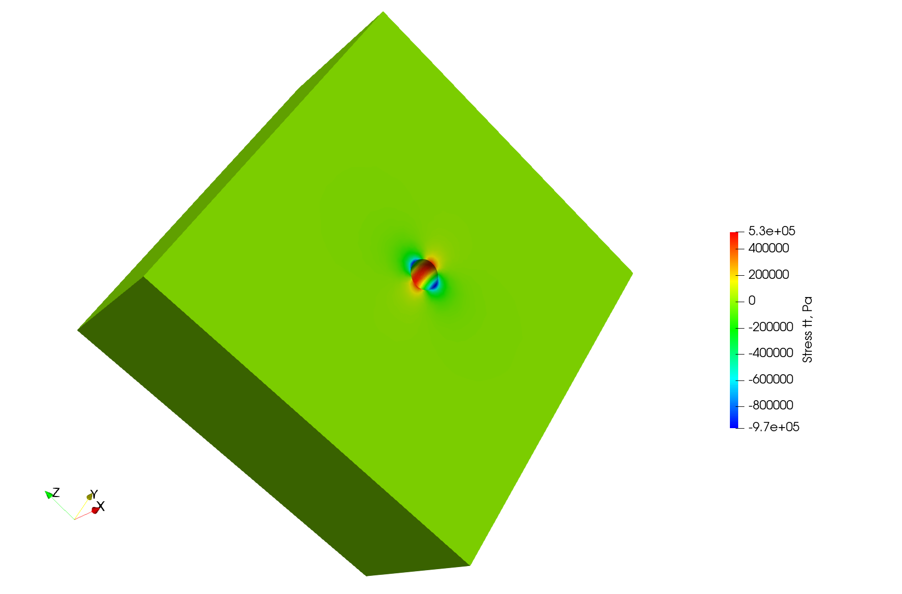
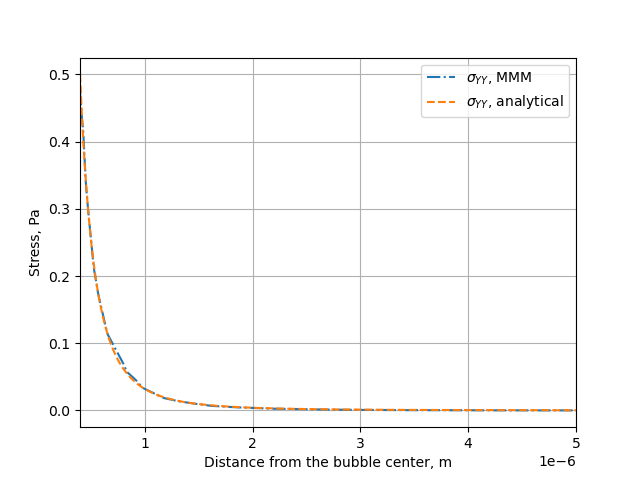

# Simulation of pressurized bubbles


## Problem description

The default example is one spherical porosity in a quasi-infinite medium. The boundary conditions for the problem are periodical, and we consider a null macroscopic displacement gradient. 

In the general case, the null periodic displacement boundary condition prevents the volume expansion with a non-zero macroscopic hydrostatic stress. The latter can be derived from the periodic elastic stress field by

$$
p_{hyd} = -\dfrac{1}{3} tr\left(\dfrac{1}{V}\int_V \overline{\overline{\sigma}} dV\right)
$$

where $$V$$ is the volume of the RVE and $$\overline{\overline{\sigma}}$$ the Cauchy stress tensor. The corresponding internal stress field induced by an internal pressure equal to $$p_{in}-p_{hyd}$$ in the porosities and a stress-free periodic boundary condition can be derived from the elastic superposition principle

$$
\overline{\overline{σ}}\left(p_{in}-p_{hyd}, 0\right) = \overline{\overline{σ}}\left(p_{in},p_{hyd}\right)+ p_{hyd} \overline{\overline{I}}  
$$

with $$\overline{\overline{I}}$$ being the identity tensor.

### Link to transient fission gas release

Fission gas stored in high burnup structure (HBS) porosities into nuclear fuel can be release due to an overfragmentation mechanisms under certain conditions: we can use the present model to investigate this phenomenon. The fracture assessment is done based on a purely elastic calculation: from the stress tensor we calculate the principal stresses, and we assess all the physical points where the following relationship is satisfied:

$$
\sigma_I^{max}\mid_i (p_{in}) > \sigma_R
$$

where $$σ_I^{max}\mid_i (p_{in})$$ is the maximal value of the first principal stress near the bubble $$i$$ submitted to the pressure $$p_{in}$$ and $$σ_R$$ the rupture stress giving the critical pressure leading to crack initiation. For a bubble $$i$$, the maximal value of the first principal stress $$\sigma_I^{max}\mid_i$$ corresponds to the maximal value at a distance $$R+\delta$$ from the centre of the bubble, with R the radius of the bubble and $$δ$$ the distance needed to reach the first Gauss integration point around the bubble in the finite element mesh.

The fractional fission gas release for bubbles having all the same internal pressure $$p_{int}$$ can be calculated as follows

$$
FGR=\dfrac{∑_i\left[V_i \mid\left(σ_I^{max} \mid_i \left(p_{in}\right)\right)>σ_R \right]}{∑_{i=1}^n V_i}
$$

under the assumption that, just after crack initiation, its propagation occurs under an unstable condition, effectively enabling the release of all the amount of gas contained in the bubble outside from the HBS volume element.

## The test-case

The default example is constituted by a single spherical porosity in a quasi-infinite medium. The finite element solution can be compared with an analytical solution giving the elastic stress field as a function of the internal pressure, the bubble radius, and the distance from the bubble. As mentioned above, the boundary conditions for the problem are periodical, and we consider a null macroscopic displacement gradient, which in turns generate a uniform compressive hydrostatic pressure on the REV. In this case with one porosity in a quasi-infinite medium, the compressive hydrostatic pressure is negligeable, in agreement with the analytical solution of equation shown above.

### Modify the geometry for the single bubble case and mesh it

The geometry for the test case is contained in the file `.geo` stored in the `mesh` folder, and considers a sphere of radius equal to 400 nm at the centre of a (periodic) cube of 10 µm of size. For a more handily management of the geometry and of the mesh, the units in the geometry file are expressesd in <b>µm</b>. One can modify it and use it as an input for `gmsh` to generate the computational mesh for the case by 

```bash
gmsh -3 single_sphere.geo
```

A file `.msh` is already provided in the folder `mesh`, generated based on the aforementioned geometry file. We have seen some slight differences in the final mesh bases on the version of `gmsh` employed.

N.B.: if the bubble center, radius, or the surface label are modified, the corresponding data stored in `single_bubble.txt` must also be changed.
N.B. bis: `single_bubble_ci.txt` is used for GitHub continuous integration.

## Set-up the physical problem

The simulation considers an empty (i.e., not meshed) cavity, on whose surface we impose an arbitrary uniform pressure (unitary by default). The medium is described by a purely elastic constitutive relationship, characterized by two elastic constants 

 - E = 150.10<sup>-3</sup> N µm<sup>-2</sup>
 - $$\nu = 0.3$$

The elastic modulus is rescaled to coherently describe the geometry in micrometers, rather than in S.I. units. This choice is done to facilitate the creation of more complex geometries when using `Mérope`, given the characteristic length scale of the considered inclusions.

The geometry is meshed using quadratic elements, to better describe the spherical inclusions contained in the representative elementary volume (REV). Despite `MFEM` allows sub-, super-, and isoparametric analyses, we recommend to stick at least to the isoparametric choice (i.e., not subparametric) for the polynomial shape functions.

The boundary conditions for the problem are periodical, and we consider a null macroscopic displacement gradient, which in turns generates a uniform compressive hydrostatic pressure on the REV.

### Parameters

Command-line Usage

```
Usage: ./test-bubble [options] ...
```


| Option                                | Type   | Default                  | Description                                 |
| ------------------------------------- | ------ | ------------------------ | ------------------------------------------- |
| `-h, --help`                          | —      | —                        | Print the help message and exit.            |
| `-m <string>, --mesh <string>`        | string | `mesh/single_sphere.msh` | Mesh file to use.                           |
| `-l <string>, --library <string>`     | string | `src/libBehaviour.so`    | Material behaviour library.                 |
| `-f <string>, --bubble-file <string>` | string | `mesh/single_bubble.txt` | File containing the bubble definitions.     |
| `-o <int>, --order <int>`             | int    | `2`                      | Finite element order (polynomial degree).   |
| `-r <int>, --refinement <int>`        | int    | `0`                      | Refinement level of the mesh (default = 0). |
| `-p <int>, --post-processing <int>`   | int    | `1`                      | Run the post-processing step.               |
| `-v <int>, --verbosity-level <int>`   | int    | `0`                      | Verbosity level of the output.              |

The command to execute the test-case is

```bash
mpirun -n 6 ./test-bubble
```

Below we show a contour plot of the $$YY$$ component of the stress tensor (upper half of the cube) and of the first principal streess (bottom half of the cube).



## Verification against the analytical solution

The problem of a pressurized spherical inclusion in an infinite elastic medium has a closed-form solution for the expressions of the hoop stress as a function of the distance from the sphere center:

$$
\sigma_{\theta\theta}(r) = \dfrac{p_{in}*R_b^3}{2r^3}
$$

where $p_{in}$ is the internal pressure, $R_b$ the bubble radius, and reminding that the expression is holding for $r>R_b$.

The script available in `verification/bubble` can be used to compare the analytical solution to the MMM one:

```bash
python3 mmm_vs_analytical.py 
```
The comparison between the computational results and and the analytical solution is showed below.


