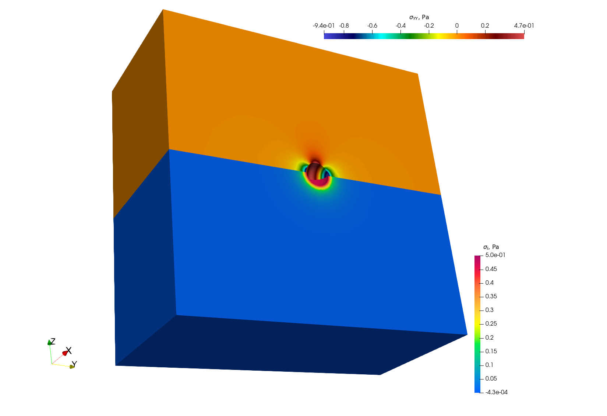

# Simulation of pressurized bubbles


## Short Description

This example focuses on the rupture of a spherical, pressurized inclusion (e.g., a gas bubble) in an elastic infinite medium.

The criterium to determine the rupture or not is based on a simple geometrical assumption, i.e., if a certain distance $d_{min}$ is found between the position of the center of the sphere and the location of the maximum principal stress caused by the pressure exerted by the bubble on the surrounding matrix.

## Modify the geometry for the single bubble case and mesh it

The geometry for the test case is contained in the file `.geo` stored in the `mesh` folder. One can modify it and use it as an input for `gmsh` to generate the computational mesh for the case by 

```bash
gmsh -3 single_sphere.geo
```

A file `.msh` is already provided in the folder `mesh`, generated based on the aforementioned geometry file. We have seen some slight differences in the final mesh bases on the version of `gmsh` employed.

NB: if the bubble center, radius, or the surface label are modified, the corresponding data stored in `single_bubble.txt` must also be changed.



## Set-up the physical problem

The simulation considers an empty (i.e., not meshed) cavity, on whose surface we impose an arbitrary uniform pressure (unitary by default). The medium is described by a purely elastic constitutive relationship, characterized by two elastic constants 

 - E = 150 N µm<sup>2</sup>
 - $$\nu = 0.3$$

The elastic modulus is rescaled to coherently describe the geometry in micrometers, rather than in S.I. units. This choice is done to facilitate the creation of more complex geometries when using `Mérope`, given the characteristic lengthscale of the considered inclusions.

The geometry is meshed using quadratic elements, to better describe the spherical inclusions contained in the representative elementary volume (REV). Despite `MFEM` allows sub-, super-, and isoparametric analyses, we recommend to stick at least to the isoparametric choice (i.e., not subparametric) for the polynomial shape functions.

The boundary conditions for the problem are periodical, and we consider a null macroscopic displacement gradient, which in turns generate a uniform compressive hydrostatic pressure on the REV.

### Parameters

Command-line Usage

```
Usage: ./test-bubble [options] ...
```


| Option                                | Type   | Default                  | Description                                 |
| ------------------------------------- | ------ | ------------------------ | ------------------------------------------- |
| `-h, --help`                          | —      | —                        | Print the help message and exit.            |
| `-m <string>, --mesh <string>`        | string | `mesh/single_sphere.msh` | Mesh file to use.                           |
| `-l <string>, --library <string>`     | string | `src/libBehaviour.so`    | Material behaviour library.                 |
| `-f <string>, --bubble-file <string>` | string | `mesh/single_bubble.txt` | File containing the bubble definitions.     |
| `-o <int>, --order <int>`             | int    | `2`                      | Finite element order (polynomial degree).   |
| `-r <int>, --refinement <int>`        | int    | `0`                      | Refinement level of the mesh (default = 0). |
| `-p <int>, --post-processing <int>`   | int    | `1`                      | Run the post-processing step.               |
| `-v <int>, --verbosity-level <int>`   | int    | `0`                      | Verbosity level of the output.              |


## Verification against the analytical solution

The problem of a pressurized spherical inclusion in an infinite elastic medium has a closed-form solution for the expressions of the stresses as a function of the distance from the sphere center:

$$
\sigma_{\theta\theta}(r) = \dfrac{p_{in}*R_b^3}{2r^3}
$$

where $p_{in}$ is the internal pressure, $R_b$ the bubble radius, and reminding that the expression is holding for $r>R_b$.


The script available in `verification/bubble` can be used to compare the analytical solution to the MMM one, by just placing the script in the post-processing folder and executing it 

```bash
python3 mmm_vs_analytical.py 
```
The comparison obtained running the test-case considering the FE mesh available `bubble/mesh/single_sphere.msh` and the analytical solution is showed below.


