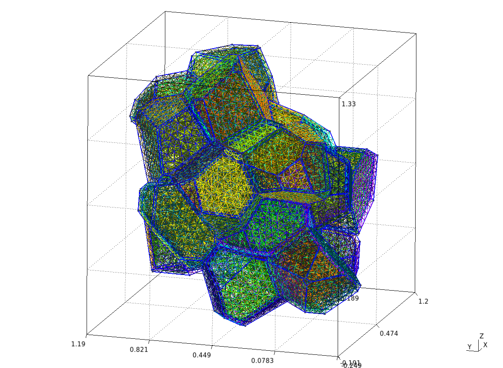
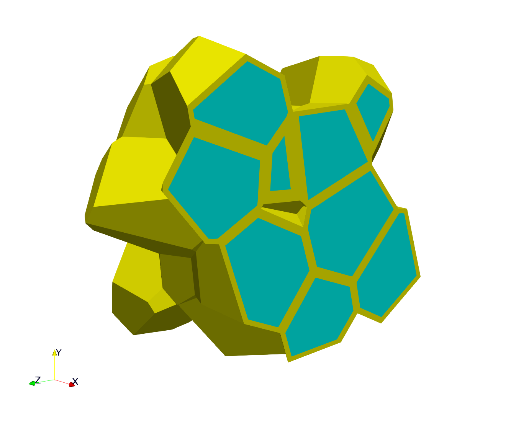
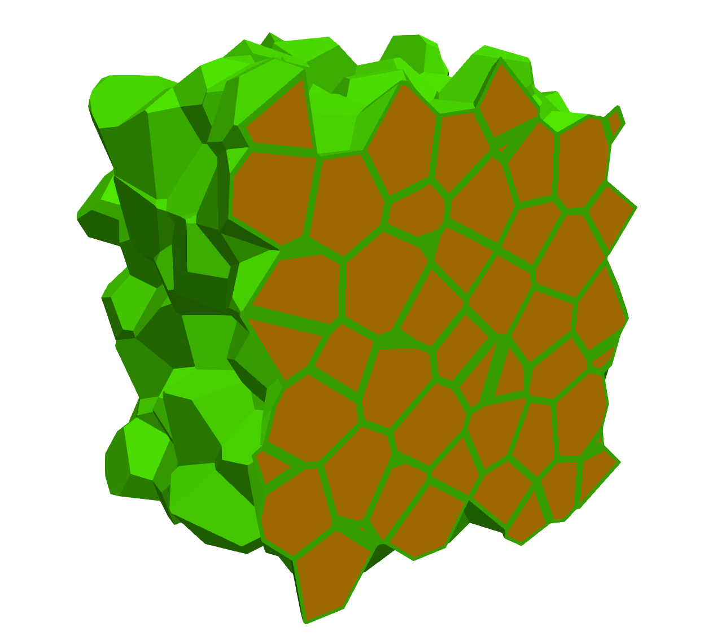

# Cermet simulation

## Mesh generation

Mesh example: `cermet-opera-hpc-mini.py`


Please load `MEROPE_DIR` before.

```
source ${MEROPE_DIR}/Env_Merope.sh
python3 mesh/cermet-opera-hpc-mini.py # generate cermet-mini.geo
gmsh -3 cermet-mini.geo # generate cermet-mini.msh
```

### Options

In your python script: 

```
L = [1, 1, 1]
nbSpheres = 20 
distMin = 0.3
randomSeed = 0
layer=0.02
MeshOrder = 1
MeshSize = 0.05
```

Example to generate 250 grains, 12913361 nodes, and 86213779 elements.


```
L = [5, 5, 5]
nbSpheres = 250
distMin = 0.1
randomSeed = 0
layer=0.04
MeshOrder = 1
MeshSize = 0.02
```

### Output Example: cermet-mini.msh





### Output Example: cermet-big.msh



## Run your simulation

### cermet with a Norton law

```
Usage: ./cermet-norton [options] ...
Options:
   -h, --help
	Print this help message and exit.
   -m <string>, --mesh <string>, current value: mesh/cermet-mini.msh
	Mesh file to use.
   -o <int>, --order <int>, current value: 1
	Finite element order (polynomial degree).
   -r <int>, --refinement <int>, current value: 1
	refinement level of the mesh, default = 1
   -p <int>, --post-processing <int>, current value: 1
	run post processing step
   -v <int>, --verbosity-level <int>, current value: 0
	choose the verbosity level
   -d <double>, --duration <double>, current value: 5
	choose the duration (default = 5)
   -n <double>, --nstep <double>, current value: 5
	choose the number of steps (default = 40)
```
