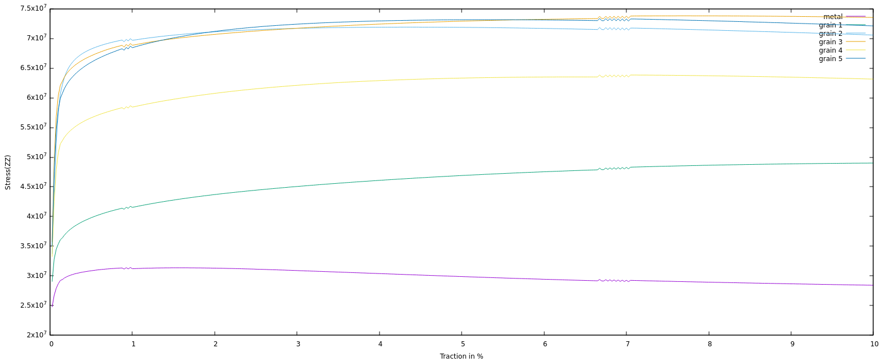
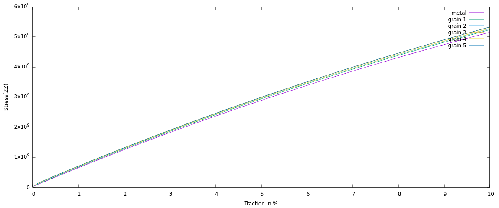

# Cermet simulation

## Mesh generation

Mesh example: `cermet-opera-hpc-mini.py`


Please load `MEROPE_DIR` before.

```
source ${MEROPE_DIR}/Env_Merope.sh
python3 mesh/5grains.py # generate 5grains.geo
gmsh -3 5grains.geo # generate 5grains.msh
```

### Options

In your python script: 

```
L = [1, 1, 1]
nbSpheres = 20 
distMin = 0.3
randomSeed = 0
layer=0.02
MeshOrder = 1
MeshSize = 0.05
```

Example to generate 250 grains, 12913361 nodes, and 86213779 elements.


```
L = [5, 5, 5]
nbSpheres = 250
distMin = 0.1
randomSeed = 0
layer=0.04
MeshOrder = 1
MeshSize = 0.02
```

### Output Example: 5grains.msh


### Output Example: cermet-big.msh


## Run your simulation

### Parameters

```
Usage: ./cermet [options] ...
Options:
   -h, --help
	Print this help message and exit.
   -m <string>, --mesh <string>, current value: mesh/5grains.msh
	Mesh file to use.
   -o <int>, --order <int>, current value: 1
	Finite element order (polynomial degree).
   -r <int>, --refinement <int>, current value: 0
	refinement level of the mesh, default = 1
   -p <int>, --post-processing <int>, current value: 1
	run post processing step
   -v <int>, --verbosity-level <int>, current value: 0
	choose the verbosity level
   -d <double>, --duration <double>, current value: 200
	choose the duration (default = 5)
   -n <int>, --nstep <int>, current value: 400
	choose the number of steps (default = 40)
   -f <string>, --file <string>, current value: vectors_5grains.txt
	Vector file to use
   -bcs <int>, --bcs_type <int>, current value: 0
	Types of boundary conditions. For all BCs, a displacement of def = 5e-4 m/s is imposed. Type 0: zero strain in xx and yy. Type 1: imposed displacement of -0.3 * def in xx and yy.
```

### Run it

Basic test (time 0.5s, 1 timestep, mesh= 5grains.mesh, and 0 level of uniform refinement)

```
mpirun -n 12 ./cermet --duration 0.5 --nstep 1
```

Full test (time 200s, 400 timesteps, 1 level of uniform refinement, and your own mesh)

```
mpirun -n 12 ./cermet --duration 200 --nstep 400 -r 1 --mesh yourmesh.msh
```

## Results

Current results (07/09/25) need to be check.

### 5 Grains





