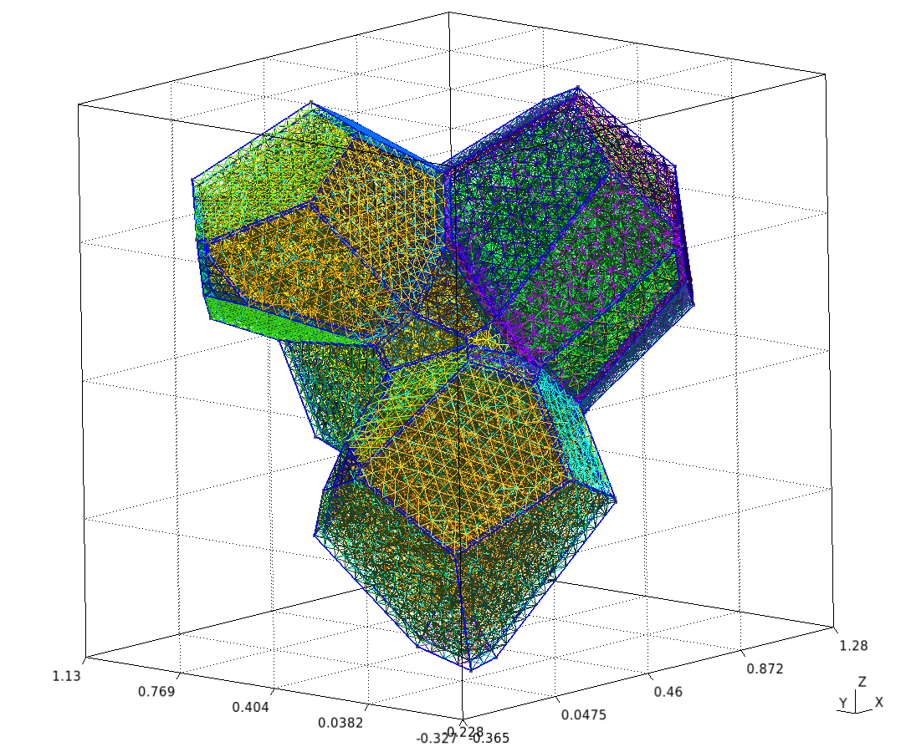
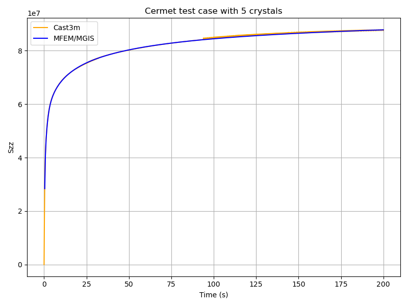

# Cermet simulation


## Short description

This simulation consists of applying a tensile load on a cermet RVE. The cermet
is a polycrystal where each grain has a material ID (from 2 to Nmat – 1) and a
different orientation. A metallic interface is present between the different
grains (material ID 1)

In addition to the mechanical analysis, this example demonstrates how to
set up a fixed-point algorithm to handle the nonlinearities associated
with crystalline plasticity at the grain scale.

Parameters:

- Boundary conditions: periodic boundary conditions are applied on the
  RVE faces. The loading is imposed in one direction, ensuring
  compatibility and equilibrium across periodic faces. More precisely,
  the axial component Fzz of the macroscopic deformation gradient is
  imposed. The off-diagonal components of the macrocroscopic deformation
  gradient are set to zero. The components Fxx and Fzz are unknowns
  which are determined by imposing that the components Sxx and Syy of
  the Cauchy stress are null. The main result of the simulation is the
  evolution of the axial component Szz of the Cauchy stress as a
  function of Fxx
- [Crystal] Constitutive law: UO₂ crystalline plasticity law[^2].
	- Young Modulus = 222.e9 Pa
	- Poisson ratio = 0.27
	- Shear Modulus = 54.e9  Pa
- [Metalic Interface] Constitutive law: Norton.
	- Young Modulus = 276e+09 Pa
	- Shear Modulus = 54.e9 
- [Metallic Interface] Constitutive law: Norton.
	- Young Modulus = 276e+09
	- Poisson ratio = 0.3
	- A             = 2.5e+11 [a. u.]
	- n1            = 4.75
	- Q             = 306.27e+03 [a. u.]
	- D0            = 1.55e-5 [a. u.]
	- b             = 2.5e-10 [a. u.]
- Finite element order: 1 (linear interpolation).
- Finite element space: H1.
- Simulation duration: 200 s.
- Number of time steps: 500.
- Linear solver: HyprePCG (solver) /  (precond)

## Mesh generation

This section explains how to generate a sample mesh with `Merope`.

Before running the script, make sure that the environment variable
`MEROPE_DIR` is properly loaded:

Then, you can generate the mesh in two steps:

```
source ${MEROPE_DIR}/Env_Merope.sh
python3 mesh/5grains.py # generate 5grains.geo
gmsh -3 5grains.geo # generate 5grains.msh
```

You will obtain a 3D mesh (5grains.msh) of a polycrystalline sample with 5 grains.

### Options

Mesh Generation Examples

The mesh can be customized by adjusting the input parameters in the Python script.
Below are two examples:

#### Small Example

This setup generates a small polycrystalline mesh with (gmsh version `11.1`):

- 5 grains
- 12,992 nodes
- 88,687 elements

```
L = [1, 1, 1]
nbSpheres = 20 
distMin = 0.3
randomSeed = 0
layer=0.02
MeshOrder = 1
MeshSize = 0.05
```




#### Large Example

This setup generates a realistic polycrystalline mesh with:

- 250 grains
- 12,913,361 nodes
- 86,213,779 elements


```
L = [5, 5, 5]
nbSpheres = 250
distMin = 0.1
randomSeed = 0
layer=0.04
MeshOrder = 1
MeshSize = 0.02
```

## Run your simulation

### Command-line Usage


```
Usage: ./cermet [options] ...
```

| Option                                      | Type   | Default               | Description                                                                                                                                                       |
| ------------------------------------------- | ------ | --------------------- | ----------------------------------------------------------------------------------------------------------------------------------------------------------------- |
| `-h, --help`                                | —      | —                     | Print the help message and exit.                                                                                                                                  |
| `-m <string>, --mesh <string>`              | string | `mesh/5grains.msh`    | Mesh file to use.                                                                                                                                                 |
| `-o <int>, --order <int>`                   | int    | `1`                   | Finite element order (polynomial degree).                                                                                                                         |
| `-r <int>, --refinement <int>`              | int    | `0`                   | Refinement level of the mesh (default = 1).                                                                                                                       |
| `-p <int>, --post-processing <int>`         | int    | `1`                   | Run the post-processing step.                                                                                                                                     |
| `-v <int>, --verbosity-level <int>`         | int    | `0`                   | Verbosity level of the output.                                                                                                                                    |
| `-d <double>, --duration <double>`          | double | `200`                 | Duration of the simulation (default = 5).                                                                                                                         |
| `-n <int>, --nstep <int>`                   | int    | `400`                 | Number of simulation steps (default = 40).                                                                                                                        |
| `-f <string>, --file <string>`              | string | `vectors_5grains.txt` | Vector file to use.                                                                                                                                               |
| `--macroscopic-stress-output-file <string>` | string | `cermet.res`          | Main output file containing:<br>• Evolution of the diagonal components of the deformation gradient<br>• Evolution of the diagonal components of the Cauchy stress |


### Run it

You can run the simulation in parallel using MPI.
Below are two examples:

#### Basic Test

Runs a short simulation with:

- Duration = 0.5 s
- 1 timestep
- Mesh = 5grains.msh
- Refinement level = 0


```
mpirun -n 12 ./cermet --duration 0.5 --nstep 1
```

#### Full Test

Runs a longer simulation with:

- Duration = 200 s
- 400 timesteps
- Custom mesh (yourmesh.msh)
- Refinement level = 1

```
mpirun -n 12 ./cermet --duration 200 --nstep 400 -r 1 --mesh yourmesh.msh
```

## Results

By default, the simulation generates the file cermet.res when running:

```
mpirun -n 12 ./cermet
```

To validate the results, the Cauchy stress component in the z-direction ($\overline{\sigma}_{zz}$) can be compared with reference values obtained from Cast3M.

### Plot and Compare

To visualize and compare the results, run the following Python script:

```
python3 plot_cermet_results.py
```

This script generates a figure named: `plot_cermet.png`




### Check the Values

To verify the simulation results, run the following Python script:

```
python3 check_cermet_restults.py
```

The expected output is: `Check PASS`.

An example of the detailed output:

```
      Time     MFEM/MGIS      CAST3M  RelDiff_% Status
0      0.4  2.837174e+07  29462000.0   3.842755     OK
1      0.8  4.101172e+07  41798000.0   1.917200     OK
2      1.2  4.674008e+07  47113000.0   0.797856     OK
3      1.6  5.042402e+07  50687000.0   0.521535     OK
4      2.0  5.321536e+07  53452000.0   0.444677     OK
..     ...           ...         ...        ...    ...
495  198.4  8.775101e+07  87802000.0   0.058103     OK
496  198.8  8.775917e+07  87724000.0  -0.040076     OK
497  199.2  8.776730e+07  87804000.0   0.041820     OK
498  199.6  8.777539e+07  87814000.0   0.043988     OK
499  200.0  8.778345e+07  87737000.0  -0.052917     OK

[500 rows x 5 columns]
Check PASS.
```

This table shows the comparison between the simulated Cauchy stress values and the reference Cast3M results, along with the relative difference and a status check.
