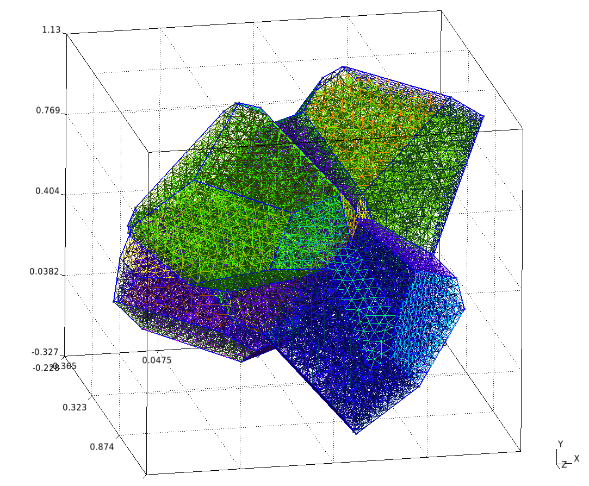

# Polycrystal

## Problem definition

This test case illustrates the simulation of a Representative Volume Element (`RVE`) of a polycrystal made of uranium dioxide (`UO₂`). The objective is to study the mechanical response of the material under a XXX (uniaxial loading?) condition.

In addition to the mechanical analysis, this example demonstrates how to set up a fixed-point algorithm to handle the nonlinearities associated with crystalline plasticity at the grain scale.

- Boundary conditions: periodic boundary conditions are applied on the RVE faces. The loading is imposed in one direction, ensuring compatibility and equilibrium across periodic faces.
- Constitutive law: UO₂ crystalline plasticity law[^2].
- Finite element order: 1 (linear interpolation).
- Finite element space: H1.
- Simulation duration: 200 s.
- Number of time steps: 600.

## Mesh generation

Mesh example: `5cristals.py`

Please load `MEROPE_DIR` before.

```
source ${MEROPE_DIR}/Env_Merope.sh
python3 mesh/5cristals.py # generate 5grains.geo
gmsh -3 5cristals.geo # generate 5grains.msh
```

The geometry of the RVE is generated using the Mérope [^1] toolkit. For this example, a polycrystal with 5 grains is built.

Make sure to load the `MEROPE` environment before running the mesh generation script:

```
source ${MEROPE_DIR}/Env_Merope.sh
python3 mesh/5cristals.py   # generates 5cristals.geo
gmsh -3 5cristals.geo       # generates 5cristals.msh
```

### Mesh generation options

The following parameters are set in the `5cristals.py` script:

```
L = [1, 1, 1]        # Dimensions of the RVE box
nbSpheres = 5        # Number of grains (polycrystal composed of 5 crystals)
distMin = 0.4        # Minimum distance between sphere centers
randomSeed = 0       # Random seed for reproducibility
MeshOrder = 1        # Polynomial order of elements
MeshSize = 0.05      # Target mesh size
```

The resulting polycrystal is composed of 5 grains.

### Mesh Polycristal composed of 5 cristals




## Simulation options


The main executable for this test case is uniaxial-polycristal. Its command-line options are:

```
Usage: ./uniaxial-polycristal [options] ...
Options:
   -h, --help
	Print this help message and exit.
   -m <string>, --mesh <string>, current value: mesh/5cristals.msh
	Mesh file to use.
   -f <string>, --vect <string>, current value: mesh/vectors_5cristals.txt
	Vector file to use.
   -l <string>, --library <string>, current value: src/libBehaviour.so
	Material library.
   -b <string>, --behaviour <string>, current value: Mono_UO2_Cosh_Jaco3
	Mechanical behaviour.
   -o <int>, --order <int>, current value: 1
	Finite element order (polynomial degree).
   -r <int>, --refinement <int>, current value: 0
	refinement level of the mesh, default = 0
   -v <int>, --verbosity-level <int>, current value: 0
	choose the verbosity level
   -d <double>, --duration <double>, current value: 200
	choose the duration (default = 200)
   -n <int>, --nstep <int>, current value: 600
	choose the number of steps (default = 600)
   --linear-solver <string>
        linear solver to be used, default to HyprePCG
   --linear-solver-preconditioner <string>
        preconditioner of the linear solver to be used, defaults to HypreBoomerAMG.
	none can be specified for not using a preconditioner
   --macroscopic-stress-output-file <string>, current value: uniaxial-polycrystal.res
        main output file containing the evolution of the diagonal components of the deformation
        gradient and the  diagonal components of the Cauchy stress
   --enable-post-processings,
	execute post-processings (default option)
   --enable-export-von-Mises-stress, 
        export the von Mises stress
   --enable-export-first_eigen_stress,
        export first eigen stress
   --disable-post-processings,
	don't execute post-processings
   --disable-export-von-Mises-stress, 
        don't export the von Mises stress (default option)
   --disable-export-first_eigen_stress,
        don't export first eigen stress (default option)
```

Note: To generate the grain orientation vectors, use the randomVectorGeneration tool provided in the distribution. This ensures a consistent and physically realistic initialization of crystallographic orientations.


## Results && Post processings

## References

[^1]: JOSIEN, Marc. Mérope: A microstructure generator for simulation of heterogeneous materials. Journal of Computational Science, 2024, vol. 81, p. 102359.
[^2]: PORTELETTE, Luc, AMODEO, Jonathan, MADEC, Ronan, et al. Crystal viscoplastic modeling of UO2 single crystal. Journal of Nuclear Materials, 2018, vol. 510, p. 635-643.
