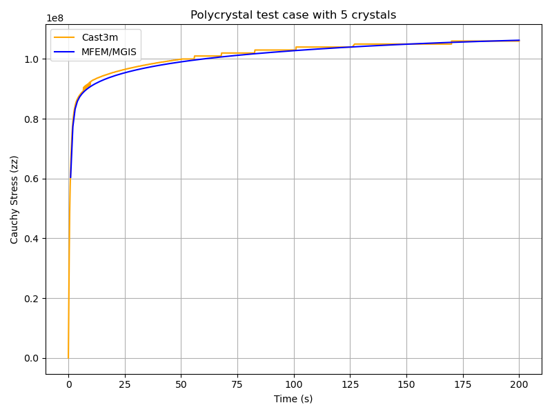

# Polycrystal

## Problem definition

This test case illustrates the simulation of a Representative Volume Element (RVE) of a polycrystal made of uranium dioxide (UO₂). The objective is to study the mechanical response of the material under a uniaxial loading (see the description of the boundary conditions below). In addition to the mechanical analysis, this example implements a fixed-point algorithm enabling the simulation of a uniaxial compression/tensile test with periodic boundary conditions.	

- **Boundary conditions:** periodic boundary conditions are applied on the RVE faces. The loading is imposed in one direction, ensuring compatibility and equilibrium across periodic faces. More precisely, the axial component Fzz of the macroscopic deformation gradient is imposed. The off-diagonal components of the macroscopic deformation gradient are set to zero. The components Fxx and Fzz are the unknowns, they are determined via the fixed-point algorithm imposing null values for the components Sxx and Syy of the macroscopic Cauchy stress tensor. The main result used for verification is a stress-strain curve with the evolution of the axial component Szz of the Cauchy stress as a function of Fxx.
- **Finite element order:** 1 (linear interpolation).
- **Finite element space:** H1.
- **Simulation duration:** 200 s.
- **Number of time steps:** 600.
- **[Crystal] Constitutive law:** The UO₂ crystal plasticity law used in the example is detailed in the reference [^2], the corresponding Mfront file is on the MMM Github. In the case of Uranium dioxide, the crystal symmetry is cubic and the corresponding orthotropic elastic properties used in the crystal plasticity law are:
	- Young Modulus = 222.e9 Pa
	- Poisson ratio = 0.27
	- Shear Modulus = 54.e9 Pa

The orthotropic basis of each grain is given as input data of the material parameter of the crystal plasticity law. This orthotropic basis is pre computed with the Euler angles of the grain. The fixed-point algorithm used the homogenized elastic properties of the polycrystal in order to predict the displacement gradient needed to converge toward a uniaxial tensile test. These macroscopic properties are derived from the single crystal elastic constant given above with the mean values of the Voigt and Reuss bounds for an isotropic polycrystal (see `MacroscropicElasticMaterialProperties.cxx` on the repository).

## Mesh generation

This section explains how to generate a sample mesh with Merope [^1] toolkit.

Before running the script, make sure that the environment variable
`MEROPE_DIR` is properly loaded:

Then, you can generate the mesh in two steps:

```
source ${MEROPE_DIR}/Env_Merope.sh
python3 mesh/5crystals.py # generate 5crystals.geo
gmsh -3 5crystals.geo # generate 5crystals.msh
```

You will obtain a 3D mesh (5crystals.msh) of a polycrystalline sample
with 5 grains. Make sure to load the `MEROPE` environment before running the mesh generation script:

```
source ${MEROPE_DIR}/Env_Merope.sh
python3 mesh/5crystals.py   # generates 5crystals.geo
gmsh -3 5crystals.geo       # generates 5crystals.msh
```

### Mesh generation options

The following parameters are set in the `5crystals.py` script:

```
L = [1, 1, 1]        # Dimensions of the RVE box
nbSpheres = 5        # Number of grains (polycrystal composed of 5 crystals)
distMin = 0.4        # Minimum distance between sphere centers
randomSeed = 0       # Random seed for reproducibility
MeshOrder = 1        # Polynomial order of elements
MeshSize = 0.05      # Target mesh size
```

The resulting polycrystal is composed of 5 grains.

### Mesh Polycrystal composed of 5 crystals


## Simulation options


The main executable for this test case is uniaxial-polycrystal. Its
command-line options are:

```
Usage: ./uniaxial-polycrystal --help 
```

| Option                                      | Type   | Default                      | Description                                                                                                                                   |
| ------------------------------------------- | ------ | ---------------------------- | --------------------------------------------------------------------------------------------------------------------------------------------- |
| `-h, --help`                                | —      | —                            | Print the help message and exit.                                                                                                              |
| `-m <string>, --mesh <string>`              | string | `mesh/5crystals.msh`         | Mesh file to use.                                                                                                                             |
| `-f <string>, --vect <string>`              | string | `mesh/vectors_5crystals.txt` | Vector file to use.                                                                                                                           |
| `-l <string>, --library <string>`           | string | `src/libBehaviour.so`        | Material library.                                                                                                                             |
| `-b <string>, --behaviour <string>`         | string | `Mono_UO2_Cosh_Jaco3`        | Mechanical behaviour.                                                                                                                         |
| `-o <int>, --order <int>`                   | int    | `1`                          | Finite element order (polynomial degree).                                                                                                     |
| `-r <int>, --refinement <int>`              | int    | `0`                          | Refinement level of the mesh (default = 0).                                                                                                   |
| `-v <int>, --verbosity-level <int>`         | int    | `0`                          | Verbosity level of the output.                                                                                                                |
| `-d <double>, --duration <double>`          | double | `200`                        | Duration of the simulation.                                                                                                                   |
| `-n <int>, --nstep <int>`                   | int    | `600`                        | Number of simulation steps.                                                                                                                   |
| `--linear-solver <string>`                  | string | `HyprePCG`                   | Linear solver to be used.                                                                                                                     |
| `--linear-solver-preconditioner <string>`   | string | `HypreBoomerAMG`             | Preconditioner for the linear solver. Use `none` to disable.                                                                                  |
| `--macroscopic-stress-output-file <string>` | string | `uniaxial-polycrystal.res`   | Output file containing the evolution of the diagonal components of the deformation gradient and the diagonal components of the Cauchy stress. |
| `--enable-post-processings`                 | bool   | `false`                      | Execute post-processing steps (default).                                                                                                      |
| `--disable-post-processings`                | bool   | —                            | Do not execute post-processing steps.                                                                                                         |
| `--enable-export-von-Mises-stress`          | bool   | `false`                      | Export the von Mises stress.                                                                                                                  |
| `--disable-export-von-Mises-stress`         | bool   | —                            | Do not export the von Mises stress (default).                                                                                                 |
| `--enable-export-first_eigen_stress`        | bool   | `false`                      | Export the first eigen stress.                                                                                                                |
| `--disable-export-first_eigen_stress`       | bool   | —                            | Do not export the first eigen stress (default).                                                                                               |

Note: To generate the grain orientation vectors, use the randomVectorGeneration tool provided in the distribution. This ensures a consistent and physically realistic initialization of crystallographic orientations.


## Results && Post processings

You can run the simulation in parallel using MPI.

```
mpirun -n 16 ./uniaxial-polycrystal
```

## Check Results

By default, the simulation generates the file `uniaxial-polycrystal.res` when running:

```
mpirun -n 16 ./uniaxial-polycrystal
```

### Plot and Compare

To visualize and compare the results, run the following Python script:

```
python3 plot_polycrystal_results.py
```

This script generates a figure named `plot_polycrystal.png` as given in the Figure 6. In this figure we can observe that there is a good agreement between Cast3M and MFEM-MGIS results. Although Cast3M is our reference, the stress-strain curve shows an unexpected non-smooth evolution. These oscillations are associated to the time step discretization which was specified in the MFEM-MGIS simulation. For a larger number of time steps the Cast3M curve is smoother as the MMM results presented in Figure 6. A first analysis of this issue led us to conclude that the implicit formulation of the Cast3M code, based on a quasi-Newton algorithm using the elastic stiffness and line search type convergence acceleration, is not fully stable. The main output of this work is that the implicit formulation of MFEM-MGIS (full newton algorithm using the tangent stiffness) is very performant, thanks to the quadratic convergence and parallelization, and provides a high-quality solution. For the verification process, the number of time steps has been significantly increased in order to avoid as much as possible the oscillation of the Cast3M solution.      



### Check the Values

To verify the simulation results, run the following Python script:

```
python3 check_polycrystal_restults.py
```

The expected output is: `Check PASS`.

An example of the detailed output:

```
      Time     MFEM/MGIS       CAST3M  RelDiff_% Status
0      1.0  6.041066e+07   63100000.0   4.451762     OK
1      2.0  7.737121e+07   79000000.0   2.105167     OK
2      3.0  8.327457e+07   84300000.0   1.231384     OK
3      4.0  8.583679e+07   86600000.0   0.889139     OK
4      5.0  8.730071e+07   87900000.0   0.686468     OK
..     ...           ...          ...        ...    ...
595  199.0  1.062465e+08  106000000.0  -0.231979     OK
596  199.0  1.062465e+08  106000000.0  -0.231979     OK
597  200.0  1.062661e+08  106000000.0  -0.250424     OK
598  200.0  1.062661e+08  106000000.0  -0.250424     OK
599  200.0  1.062661e+08  106000000.0  -0.250424     OK

[600 rows x 5 columns]
Check PASS.
```

This table shows the comparison between the simulated Cauchy stress values and the reference Cast3M results, along with the relative difference and a status check.

## References

[^1]: JOSIEN, Marc. Mérope: A microstructure generator for simulation of heterogeneous materials. Journal of Computational Science, 2024, vol. 81, p. 102359.
[^2]: PORTELETTE, Luc, AMODEO, Jonathan, MADEC, Ronan, et al. Crystal viscoplastic modeling of UO2 single crystal. Journal of Nuclear Materials, 2018, vol. 510, p. 635-643.
